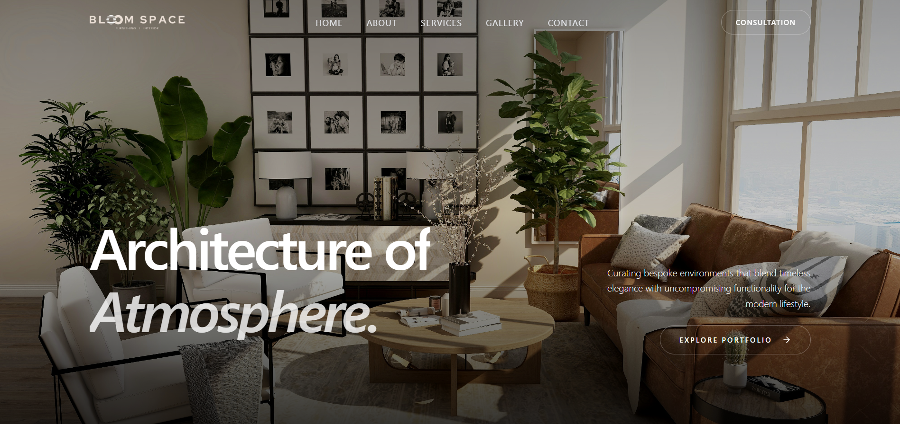
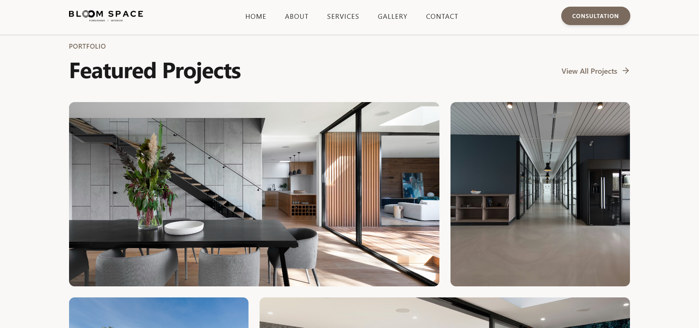
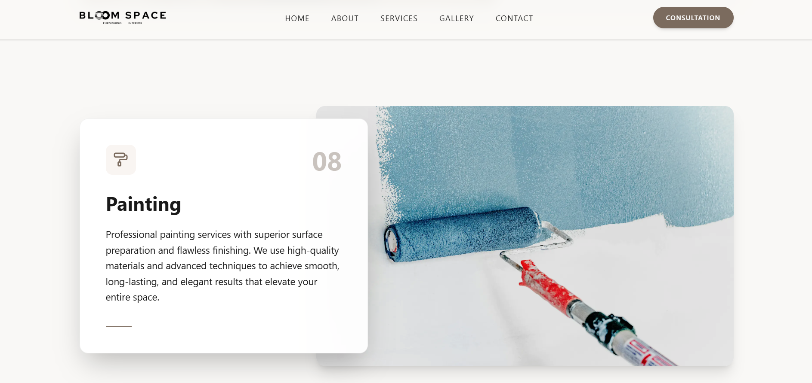
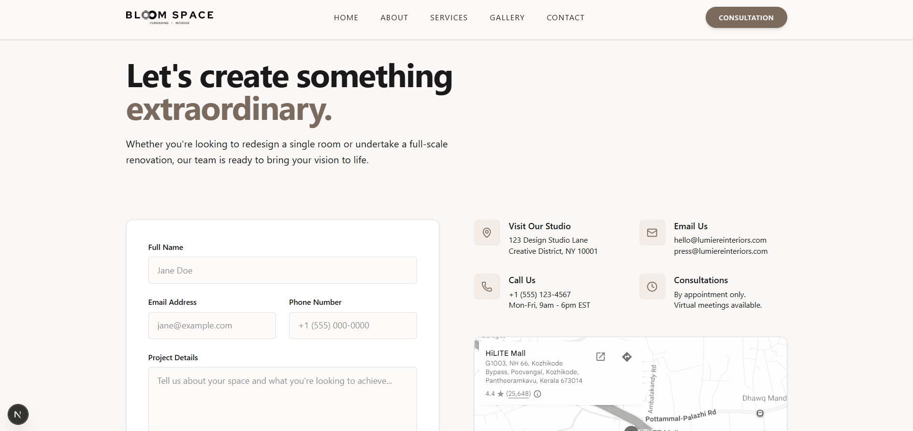

# 🏡 BloomSpace – Interior Design Website

A premium, modern frontend website built for an interior design company, focused on clean UI, smooth animations, and conversion-driven design.

🔗 **Live Demo**: https://illustrious-meringue-b785af.netlify.app/  

---

## ✨ Overview

BloomSpace is a high-quality multi-page website designed to showcase interior design services and projects with a strong focus on visual aesthetics and user experience.

This project emphasizes:
- Clean and modern UI
- Smooth user interactions
- Performance and responsiveness
- Lead generation

---

## 🚀 Features

- 🏡 Multi-page layout (Home, About, Services, Gallery, Contact)
- 🎨 Premium and modern UI design
- 🎬 Smooth animations using Framer Motion
- 🧩 Reusable components with shadcn/ui
- 📱 Fully responsive across all devices
- 📩 Contact form powered by Netlify Forms
- 📊 Snapchat Pixel integration for tracking
- ⚡ Optimized performance with Next.js

---

## 🛠️ Tech Stack

- **Framework:** Next.js 16  
- **Frontend:** React 19  
- **Styling:** Tailwind CSS 4  
- **UI Components:** shadcn/ui + Radix UI  
- **Animations:** Framer Motion  
- **Icons:** Lucide React + Phosphor Icons  
- **Forms:** Netlify Forms  
- **Tracking:** Snapchat Pixel  

---

## 📸 Screenshots

### 🏠 Home Page


### 🛋️ Services Page


### 🖼️ Gallery


### 📩 Contact Page


---

## 📂 Project Structure


/app (or pages)
/components
/lib
/public


---

## ⚙️ Installation & Setup

```bash
git clone https://github.com/Irshad-konnola/bloomspace-web.git
cd bloomspace-web
npm install
npm run dev

🎯 Key Highlights

Built for a real-world freelance client
Focused on conversion and lead generation
Clean, scalable frontend architecture
Smooth animations and premium UI experience

📊 Performance

⚡ Fast loading and optimized UI
📱 Mobile-first responsive design
🎯 UX-focused layout and structure
🧠 Concept

Designed to reflect a premium interior design brand, using clean layouts, strong typography, and smooth motion to create an engaging user experience.

🚧 Status

🚧 95% Complete

👨‍💻 Author

Irshad
Frontend Developer (React / Next.js)

LinkedIn: https://www.linkedin.com/in/irshad-konnola-954516226
Email: irshadkonnola.dev@gmail.com

⭐ Support

If you like this project, give it a ⭐ on GitHub!